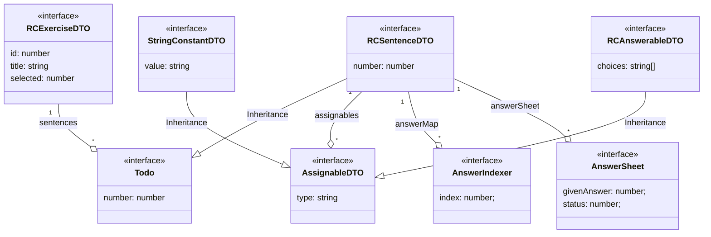

## DTO Class diagram

```mermaid
classDiagram
direction TB
class RCExerciseDTO{
    <<interface>>
    id: number
    title: string
    selected: number
}
class Todo{
    <<interface>>
    number: number
}
class RCSentenceDTO{
    <<interface>>
    number: number
}
class AssignableDTO{
    <<interface>>
    type: string
}
RCExerciseDTO "1" --o "*" Todo : sentences
RCSentenceDTO --|> Todo : Inheritance

RCSentenceDTO "1" --o "*" AssignableDTO : assignables
class StringConstantDTO{
    <<interface>>
    value: string
}
StringConstantDTO --|> AssignableDTO : Inheritance

class RCAnswerableDTO{
    <<interface>>
    choices: string[]
}
RCAnswerableDTO --|> AssignableDTO : Inheritance

class AnswerIndexer {
    <<interface>>
    index: number;
}
RCSentenceDTO "1" --o "*" AnswerIndexer : answerMap

class AnswerSheet {
    <<interface>>
    givenAnswer: number;
    status: number;
}

RCSentenceDTO "1" --o "*" AnswerSheet : answerSheet
```